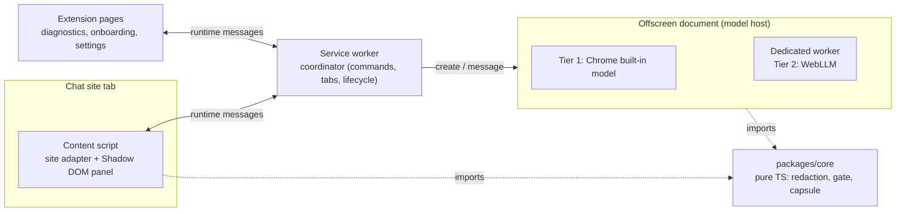
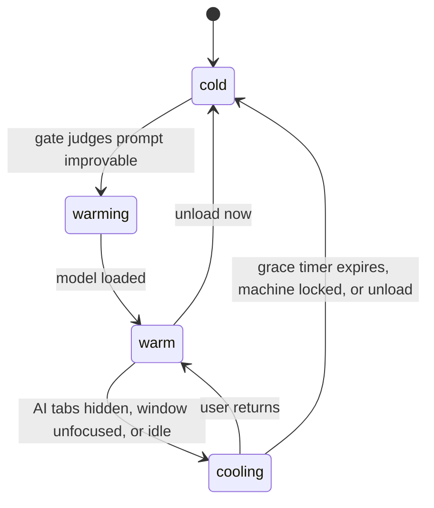
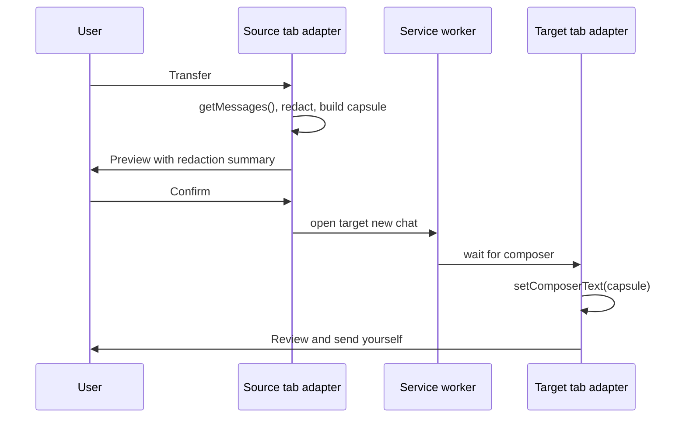
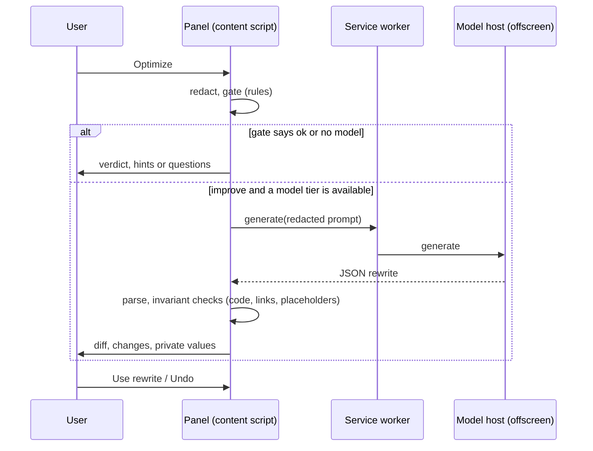

# Architecture

## Components

- `packages/core` has no `chrome.*` and no DOM access, so it runs in Node tests and any context.
- Site-specific code is limited to `extension/src/adapters/configs/*`.
- The service worker can be suspended at any time; it holds no state that matters.

## Lifecycle state machine

Implemented in `packages/core/src/engine/lifecycle.ts` as a pure reducer (`reduce`) plus a small
runner (`LifecycleManager`) that executes its effects. It runs inside the offscreen document (the
model host), which keeps one model for all tabs. The service worker forwards context: content
scripts report their tab's visibility, `windows.onFocusChanged` reports focus, and `idle` reports
idle or locked. Modes: on demand (default), keep warm while on AI sites (downgraded to on demand on
devices reporting 4 GB of memory or less), and off. Tier choice (`pickTier`) prefers a ready built-in
model, then a ready local server, then a cached WebLLM model, and otherwise stays on rules.

## Handoff sequence

The capsule text is held only in the source tab's memory and, while the new tab loads, in the
service worker's (`startHandoff` in `entrypoints/background.ts`). It is never written to storage.
Capsule rules live in `packages/core/src/handoff/capsule.ts`; what they keep is measured by
`pnpm eval:capsule`.

## Optimize sequence

The model only ever sees the redacted prompt. Placeholders stay in the chatbox unless the user
unchecks them in the review list.
